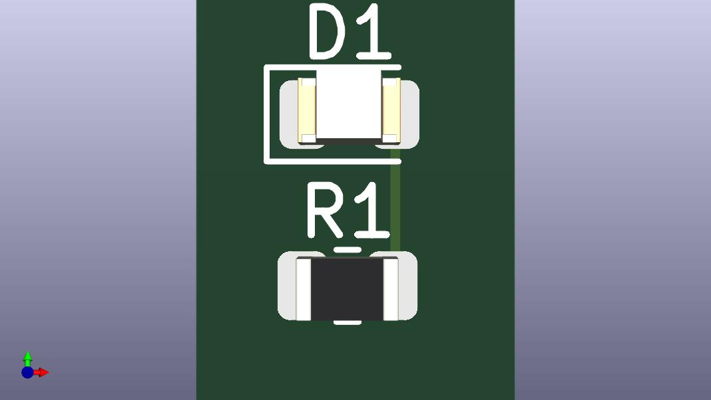

# KiCad Hardware Portfolio

A collection of electronic hardware designs, schematics, and PCB layouts created using KiCad 8.

---

## 01 - 5V LED Indicator

A compact SMD indicator circuit designed for automated PCB fabrication.

### Specifications
* *Operating Voltage:* 5 V
* *Current-Limiting Resistor:* 300 Ω (0805 SMD)
* *Indicator:* High-Efficiency LED (0805 SMD)
* *Layer Count:* 2-Layer FR4

### 3D Board Preview

### Included Design Files
* *KiCad Project:* Complete schematic (.kicad_sch) and layout (.kicad_pcb)
* *Fabrication Data:* Gerber RS-274X & Excellon drill files in 01_led_indicators/Gerbers/
* *Documentation:* Printable PDF schematic in 01_led_indicators/docs/
*
